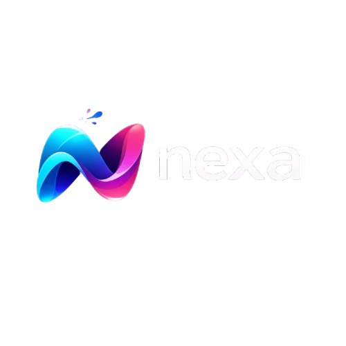

  

# Nexa — Conectando estratégia a resultado 

A **Nexa Enterprises** é uma empresa de marketing digital orientada por estratégia, dados e tecnologia.  
Atuamos no desenvolvimento, posicionamento e crescimento de marcas que buscam relevância,   
autoridade e resultados consistentes no ambiente digital.   
Cada ação nasce de análise, planejamento e execução consciente.  

---

## 📌 Visão Geral

No cenário digital atual, visibilidade sem direção gera desperdício! E a Nexa existe para transformar 
presença digital em **crescimento estruturado**, unindo criatividade, performance e inteligência estratégica.  

Trabalhamos com empresas que entendem que marketing não é custo e sim investimento!  

---

## 🎯 Missão, Visão e Valores

### **Missão**
Conectar marcas a resultados reais por meio de estratégias digitais inteligentes, criativas e sustentáveis.  

### **Visão**
Ser referência em marketing digital estratégico, reconhecida pela clareza, consistência e impacto gerado nas marcas que atendemos.  

### **Valores**
- Estratégia antes da execução  
- Clareza acima de modismos  
- Dados como base de decisão  
- Criatividade com propósito  
- Consistência e profissionalismo  
- Evolução contínua  

---

## 🛠️ Serviços Oferecidos

A Nexa atua de forma completa no marketing digital, com serviços integrados:

- **Social Media Estratégico**  
  Gestão de redes sociais com foco em posicionamento, crescimento e autoridade.

- **Design Estratégico**  
  Identidade visual e comunicação gráfica alinhadas à estratégia da marca.

- **Filmmaker & Fotografia**  
  Produção audiovisual profissional voltada para branding e conversão.

- **Copywriting**  
  Escrita estratégica focada em persuasão, clareza e vendas.

- **Tráfego Pago**  
  Gestão de anúncios orientada por dados, performance e ROI.

- **Estratégia Digital**  
  Planejamento completo da presença digital, do posicionamento à execução.

- **Marketing por Inteligência Artificial**  
  Uso de IA para análise, automação, personalização e otimização de resultados.

Cada serviço possui página dedicada, mantendo identidade visual e comunicação unificada.

---

## 🧠 Metodologia

Nosso processo é estruturado em quatro pilares:

1. **Diagnóstico**  
   Análise do negócio, mercado, concorrência e presença digital.

2. **Planejamento Estratégico**  
   Definição de posicionamento, objetivos, público e canais.

3. **Execução Integrada**  
   Conteúdo, design, tráfego e tecnologia trabalhando juntos.

4. **Análise e Otimização**  
   Monitoramento de métricas, ajustes contínuos e evolução baseada em dados.

Nada é feito no escuro.  
Tudo é mensurado, analisado e aprimorado.

---

## 🎨 Identidade Visual

A identidade visual da Nexa foi pensada para transmitir:

- Profissionalismo  
- Tecnologia  
- Autoridade  
- Consistência  

---

## 👤 Fundador & CEO

  

A Nexa nasce da visão de Vinicios Santana, fundador e CEO da empresa.

Com foco em estratégia, posicionamento e crescimento sustentável, Vinicios lidera a Nexa com uma convicção clara:
marketing não é sobre aparecer, é sobre direcionar.

A empresa foi criada para atender marcas que buscam mais do que presença digital — buscam clareza, autoridade e resultados mensuráveis.
Cada projeto conduzido pela Nexa carrega envolvimento direto de liderança estratégica, garantindo alinhamento, consistência e excelência em cada entrega.

Mais do que serviços, a Nexa oferece parceria estratégica completa, unindo:

Planejamento estratégico

Execução integrada

Performance orientada por dados

Tecnologia e Inteligência Artificial

Visão de negócio de longo prazo

Como fundador e CEO, Vinicios acredita que marcas fortes são construídas com disciplina, identidade e propósito — e é exatamente isso que a Nexa entrega.

---

## 👤 Informações de contato

📧: Nexaenterprises@gmail.com 
📞: 11 123456789 

Buscando uma oportunidade de prestar seus serviços pela Nexa? Mande seu curriculo para o email abaixo, responderemos assim que possivel.
💼: Nexaenterprisessuporte@gmail.com 

---

© 2026 • NEXA
Fundada para conectar marcas a crescimento real.
